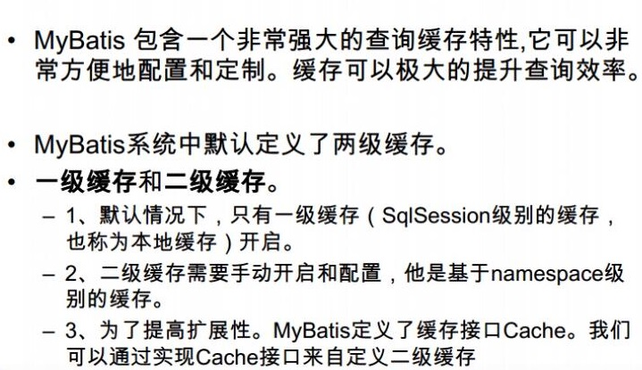

@[TOC]目录

# mybatis
## 网址
https://mybatis.org/mybatis-3/

https://github.com/mybatis

## sql拼接#和$的区别
* #{}:是以预编译的形式，将参数设置到sql语句中；PreparedStatement；防止sql注入
* ${}:取出的值直接拼装在sql语句中；会有安全问题；

大多情况下，我们去参数的值都应该去使用#{}；

## 使用sf4j
idea需要安装lombok插件

## 缓存
## 缓存介绍

先查二级缓存在查一级缓存