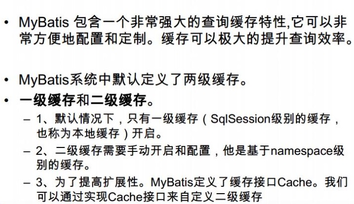

<!-- TOC -->autoauto- [mybatis](#mybatis)auto    - [网址](#网址)auto    - [sql拼接#和$的区别](#sql拼接和的区别)auto    - [使用sf4j](#使用sf4j)auto    - [缓存](#缓存)auto    - [缓存介绍](#缓存介绍)auto    - [逆向工程](#逆向工程)autoauto<!-- /TOC -->
# mybatis
## 网址
https://mybatis.org/mybatis-3/

https://github.com/mybatis

## sql拼接#和$的区别
* #{}:是以预编译的形式，将参数设置到sql语句中；PreparedStatement；防止sql注入
* ${}:取出的值直接拼装在sql语句中；会有安全问题；

大多情况下，我们去参数的值都应该去使用#{}；

## 使用sf4j
idea需要安装lombok插件

## 缓存
## 缓存介绍


先查二级缓存在查一级缓存

## 逆向工程

[mybatis逆向工程开发文档](http://mybatis.org/generator/configreference/xmlconfig.html "点击跳转")

[mybatis逆向工程的DEMO的Github地址](https://github.com/mybatis/generator "点击跳转")

[测试Demo-Github地址](https://github.com/mybatis/generator "点击跳转")

### 参考配置

[参考配置generatorConfig.xml](sources/generatorConfig.xml)

参数说明：https://www.cnblogs.com/personsiglewine/p/12867465.html

### 1.代码实现方式

```xml
<!--逆向工程代码实现依赖-->
		<dependency>
			<groupId>org.mybatis.generator</groupId>
			<artifactId>mybatis-generator-core</artifactId>
			<version>1.3.7</version>
		</dependency>
```

```java
import org.mybatis.generator.api.MyBatisGenerator;
import org.mybatis.generator.config.Configuration;
import org.mybatis.generator.config.xml.ConfigurationParser;
import org.mybatis.generator.internal.DefaultShellCallback;

import java.io.File;
import java.util.ArrayList;
import java.util.List;

public class MybatisGenerator {

    public void generator() throws Exception{
        List<String> warnings = new ArrayList<String>();
        boolean overwrite = true;
        //指定 逆向工程配置文件
        File configFile = new File("D:\\project\\水阳江\\syj-fetc\\fetc-ams\\src\\main\\resources\\generatorConfig.xml");
        ConfigurationParser cp = new ConfigurationParser(warnings);
        Configuration config = cp.parseConfiguration(configFile);
        DefaultShellCallback callback = new DefaultShellCallback(overwrite);
        MyBatisGenerator myBatisGenerator = new MyBatisGenerator(config,
                callback, warnings);
        myBatisGenerator.generate(null);
    }

    public static void main(String[] args) throws Exception {
        try {
            MybatisGenerator generatorSqlmap = new MybatisGenerator();
            generatorSqlmap.generator();
        } catch (Exception e) {
            e.printStackTrace();
        }
    }
}
```

### 2.插件实现（IDEA）

pom文件中导入插件

```xml
 <!-- 代码生成 -->
<plugin>
	<groupId>org.mybatis.generator</groupId>
	<artifactId>mybatis-generator-maven-plugin</artifactId>
	<version>1.3.2</version>
	<configuration>
		<verbose>true</verbose>
		<overwrite>true</overwrite>
	</configuration>
</plugin>
```

配置运行


点击运行即可

mybatis-generator:generate -e

### FAQ

1.代码不生成，无报错日志


# mybatis-generator自定义注释生成

https://blog.csdn.net/qq_21251983/article/details/50731368

https://blog.csdn.net/qigc_0529/article/details/80704330


# 基于MybatisGenerator扩展的 Model & Mapper & Service & Controller代码生成器

https://blog.csdn.net/fenglibing/article/details/83384337?utm_medium=distribute.pc_relevant_t0.none-task-blog-BlogCommendFromMachineLearnPai2-1.control&dist_request_id=4a06a2ad-8ee6-431c-a2ca-c4d8a9c27091&depth_1-utm_source=distribute.pc_relevant_t0.none-task-blog-BlogCommendFromMachineLearnPai2-1.control

https://github.com/fenglibin/CodeGenerator

```
使用说明
运行

进入到 src/test/java 目录下
找到CodeGeneratorMain类 为生成器的启动项
直接 Run As Java Application 运行即可

修改配置

进入到 src/test/resources 目录下
找到 generatorConfig.properties 文件
修改对应的参数即可
具体的注释信息可参考 /src/test/java/com/codegen/service/CodeGeneratorConfig.java 类

自定义生成器

参考目录src/test/java/com/codegen/generator下面相关的实现

模板样式修改

如果需要生成自己所需的 Controller & Service 样式
进入到 src/test/resources/generator/template 目录下
修改对应的ftl文件即可

数据库表名规则

表名支持单个单词的表名，如”table1“，已经根据下划线分隔的表名如“my_table1”，其它的没有测试。
```


## MyBatis中的collection两种使用方法

https://blog.csdn.net/lzxomg/article/details/89739651?utm_medium=distribute.pc_relevant_t0.none-task-blog-BlogCommendFromMachineLearnPai2-1.control&dist_request_id=e64c766f-ab2b-4701-bd46-95fbf10f3a1a&depth_1-utm_source=distribute.pc_relevant_t0.none-task-blog-BlogCommendFromMachineLearnPai2-1.control


# mapper-spring-boot-starter 应用研究


https://www.jianshu.com/p/866cccd377b5?utm_campaign=maleskine&utm_content=note&utm_medium=seo_notes&utm_source=recommendation


https://github.com/abel533/MyBatis-Spring-Boot

官方文档

https://github.com/abel533/Mapper


https://my.oschina.net/hua0517/blog/4290515


# 解决Springboot2.x+Mybatis提示Could not resolve type alias 'xxx'的问题

https://www.jianshu.com/p/81e836106f81

# 关于通用mapper中的的insertList()方法

关于通用mapper中的的insertList()方法
通用mapper中的insertList()方法有两个：

1. tk.mybatis.mapper.common.special.InsertListMapper包下的insertList()方法：
       使用该方法的实体类主键必须是自增的（需要在实体类中指出）。

如果实体的主键名为’id’,同时主键自增。在不修改代码的情况下，使用insertList()方法实现的批量插入数据后通用mapper能自动回写主键值到实体对象中。
如以下实体类和对应mapper：
————————————————
版权声明：本文为CSDN博主「虎口脱险OvO」的原创文章，遵循CC 4.0 BY-SA版权协议，转载请附上原文出处链接及本声明。
原文链接：https://blog.csdn.net/qq_40674098/article/details/96748544


# mybatis关联查询

```
<resultMap id="BaseResultMap" type="com.sunny.customer.ewarn.ZhsfWtlElwnIndex">
    <id column="ID" jdbcType="VARCHAR" property="id" />
    <result column="CREATE_BY" jdbcType="VARCHAR" property="createBy" />
    <result column="CREATE_TIME" jdbcType="TIMESTAMP" property="createTime" />
    <result column="UPDATE_TIME" jdbcType="TIMESTAMP" property="updateTime" />
    <result column="REMARK" jdbcType="VARCHAR" property="remark" />
    <result column="DEL_FLAG" jdbcType="VARCHAR" property="delFlag" />
    <result column="WTL_ELWN_ID" jdbcType="VARCHAR" property="wtlElwnId" />
    <result column="STTP" jdbcType="VARCHAR" property="sttp" />
    <result column="ADDVCD" jdbcType="VARCHAR" property="addvcd" />
    <result column="ADDVNM" jdbcType="VARCHAR" property="addvnm" />
    <result column="RVCD" jdbcType="VARCHAR" property="rvcd" />
    <result column="STCDS" jdbcType="VARCHAR" property="stcds" />
    <collection property="tableData" javaType="java.util.ArrayList" ofType="com.sunny.customer.ewarn.ZhsfWtlElwnValue"
                select="com.sunny.customer.mapper.ewarn.ZhsfWtlElwnValueMapper.selectByWtlElwnId" column="id" />
  </resultMap>
```


```
 @Select("select t1.oid,t1.user_tel,t1.code,t1.user_pass,t1.user_name,t1.dept_Id,t1.salt, t1.user_pass from t_sys_user t1 where t1.code=#{code}")
    @Results({
            @Result(id = true, column = "oid", property = "oid"),
            @Result(column = "USER_TEL", property = "userTel"),
            @Result(column = "code", property = "code"),
            @Result(column = "ukey", property = "ukey"),
            @Result(column = "user_name", property = "username"),
            @Result(column = "user_pass", property = "userpass"),
            @Result(column = "dept_Id", property = "dept",
                    one = @One(
                            select = "com.sunny.framework.dao.IDeptMapper.selectDeptByDeptId",
                            fetchType = FetchType.EAGER

                    ))
    })
     User selectUserByCode(String code) throws Exception;
     
  
@Select("select id,mockexam_section as section,id as sectionId"
			+ " from t_p_qb_mockexam_section"
			+ " where mockexam_charpter_id = #{charpterId} and is_delete = 0"
			+ " order by mockexam_section_idx asc")
@Results({
@Result(property = "questionList",column = "sectionId",many = @Many(select = "com.zikaoshu.baseinfo.mapper.BaseinfoQuestionMapper.listQuestionResDto"))})
List<SectionQuestionDto> listSectionQuestionDto(@Param("charpterId") Integer charpterId);
	

————————————————
版权声明：本文为CSDN博主「CoderYin」的原创文章，遵循CC 4.0 BY-SA版权协议，转载请附上原文出处链接及本声明。
原文链接：https://blog.csdn.net/CoderYin/article/details/90768007

@Many联查（一对多）
https://blog.csdn.net/Lonelyooacz/article/details/103358541?utm_medium=distribute.pc_relevant.none-task-blog-BlogCommendFromMachineLearnPai2-3.control&dist_request_id=&depth_1-utm_source=distribute.pc_relevant.none-task-blog-BlogCommendFromMachineLearnPai2-3.control
```

