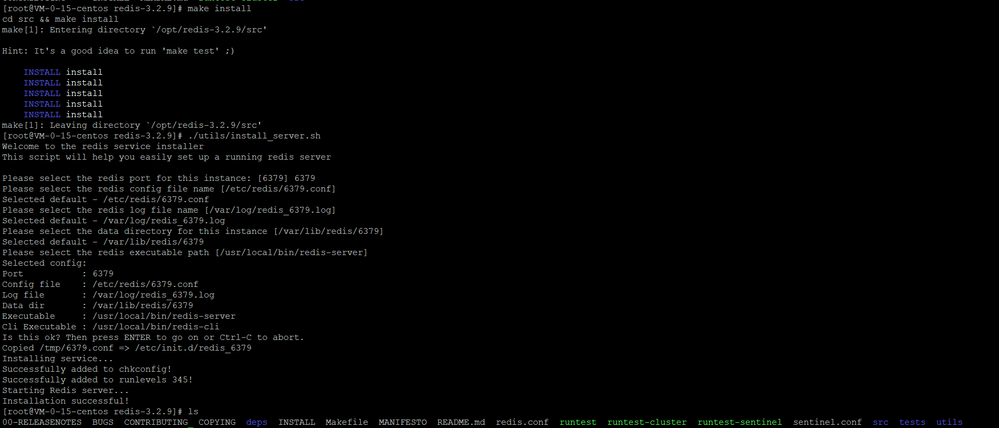

# redis使用指南

## redis历史版本下载地址

https://download.redis.io/releases/

tar xzf redis-3.2.9.tar.gz

cd redis-3.2.9

make

make install

./utils/install_server.sh

查看开机列表

chkconfig --list

通过ps -ef|grep redis命令查看Redis进程

关闭Redis服务操作通过/etc/init.d/redis_6379 stop命令，也可通过（service redis_6379 stop）

 开启Redis服务操作通过/etc/init.d/redis_6379 start命令，也可通过（service redis_6379 start）

src/redis-server

参考：https://www.jb51.net/article/111559.htm

## 集群搭建

https://blog.csdn.net/weishuai528/article/details/88998453

bind 192.168.38.128  //绑定服务器IP地址
port 7001  //绑定端口号，必须修改，以此来区分Redis实例
daemonize yes  //后台运行
pidfile /var/run/redis-7001.pid  //修改pid进程文件名，以端口号命名
logfile /opt/app/redis-cluster/logs/7001/redis.log  //修改日志文件名称，以端口号为目录来区分
dir /opt/app/redis-cluster/datas/7001/  //修改数据文件存放地址，以端口号为目录名来区分
cluster-enabled yes  //启用集群
cluster-config-file nodes-7001.conf  //配置每个节点的配置文件，同样以端口号为名称
cluster-node-timeout 15000  //配置集群节点的超时时间，可改可不改

