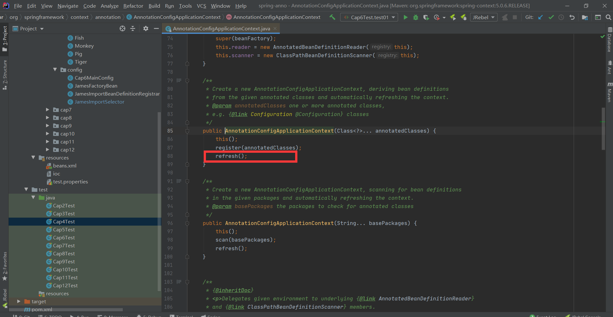
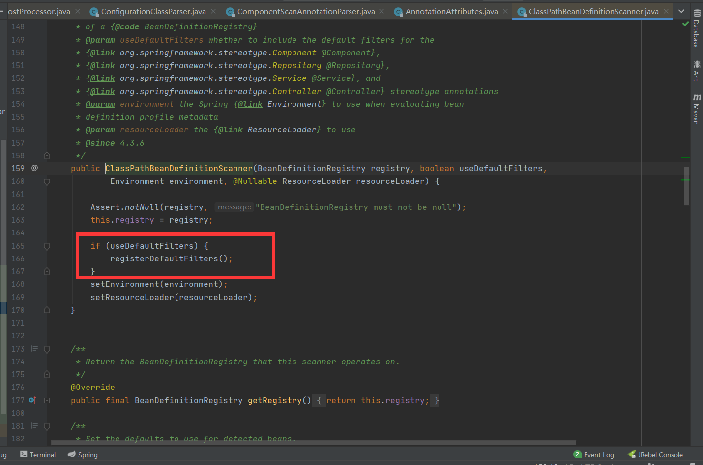

# spring学习指南

## Spring中BeanFactory与FactoryBean的区别

- 他们两个都是个工厂，但`FactoryBean`本质上还是一个Bean，也归`BeanFactory`管理

- `BeanFactory`是Spring容器的顶层接口，`FactoryBean`更类似于用户自定义的工厂接口

- BeanFactory是个Factory，也就是IOC容器或对象工厂，FactoryBean是个Bean。在Spring中，**所有的Bean都是由BeanFactory(也就是IOC容器)来进行管理的**。但对FactoryBean而言，**这个Bean不是简单的Bean，而是一个能生产或者修饰对象生成的工厂Bean,它的实现与设计模式中的工厂模式和修饰器模式类似** 

  参考：https://juejin.cn/post/6844903967600836621，https://www.cnblogs.com/aspirant/p/9082858.html

## Bean的作用域和生命周期

创建-->初始化-->销毁

### 通过@Scope指定bean的实例类型


### 给容器中注册组件的方式

```
1,@Bean: [导入第三方的类或包的组件],比如Person为第三方的类, 需要在我们的IOC容器中使用
2,包扫描+组件的标注注解(@ComponentScan:  @Controller, @Service  @Reponsitory  @ Componet),一般是针对 我们自己写的类,使用这个
3,@Import:[快速给容器导入一个组件] 注意:@Bean有点简单
	a,@Import(要导入到容器中的组件):容器会自动注册这个组件,bean 的 id为全类名
	b,ImportSelector:是一个接口,返回需要导入到容器的组件的全类名数组
	c,ImportBeanDefinitionRegistrar:可以手动添加组件到IOC容器, 所有Bean的注册可以使用BeanDifinitionRegistry
	写JamesImportBeanDefinitionRegistrar实现ImportBeanDefinitionRegistrar接口即可
4,使用Spring提供的FactoryBean(工厂bean)进行注册
```

### spring中的缓存：DefaultSingletonBeanRegistry

spring中的缓存：DefaultSingletonBeanRegistry中存储bean的不同map/set、

org.springframework.beans.factory.support.DefaultSingletonBeanRegistry这个类当中有四个缓存

- singletonObjects(ConcurrentHashMap)

​       保存BeanName和创建的bean实例之间的关系，bean name->bean instance。

- singletonFactories(HashMap)

  保存BeanName和创建bean的工厂之间的关系，bean name -> ObjectsFatory

- earlySingletonObjects(HashMap)

  也是保存BeanName和创建bean实例之间的关系，与singletonObjects之间的区别在于，当一个单例bean被放到earlySingletonObjects里面之后，该bean就可以通过getBean()方法获取到了（虽然只是早期对象，即还在创建过程中。目的是解决循环依赖的问题）

- registeredSingletons(LinkedHashSet)

  保存当前所有已注册的bean，这里为什么要用LinkedHashSet？


### 常用注解

-  **@Conditional条件注册bean**

  ```java
      @Conditional(WinCondition.class)
  	@Bean("lison")
  	public Person lison(){
  		System.out.println("给容器中添加lison.......");
  		return new Person("Lison",58);
  	}
  	
  	@Conditional(LinCondition.class)
  	@Bean("james")//bean在容器中的ID为james, IOC容器MAP,  map.put("id",value)
  	public Person james(){
  		System.out.println("给容器中添加james.......");
  		return new Person("james",20);
  	}
  ```

-  **@Import注册bean**

- 

  

  


## ComponetScan 源码分析



