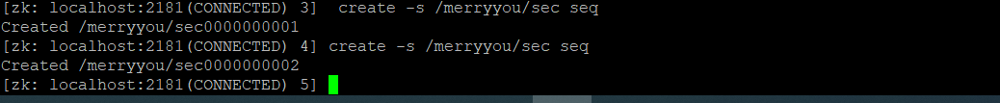

# zookee学习笔记

## 官网

https://zookeeper.apache.org/

## zookeeper安装教程

https://www.linuxidc.com/Linux/2018-03/151327.htm

zkserver启动及状态查询：

./zkServer.sh start

./zkServer.sh status

测试部署地址：

http://212.129.238.44:2181

### 连接工具

ZooInspector

##  

## 简单使用命令

- 参考网址 https://blog.csdn.net/dandandeshangni/article/details/80558383

- 连接  

  - bin/zkCli.sh

  

  查询全部节点

  ls /

- create /merryyou merryyou

- get /merryyou

- create -e  /merryyou/temp merryyou *断开重连之后，临时节点自动消失*

- get /merryyou/temp

-  create -s /merryyou/sec seq *创建顺序节点，顺序节点会自动累加*

  

- set /merryyou new-merryyou *修改节点内容为new-merryyou*
- set /merryyou test-merryyou 1 *#set 根据版本号更新 dataVersion 乐观锁*

