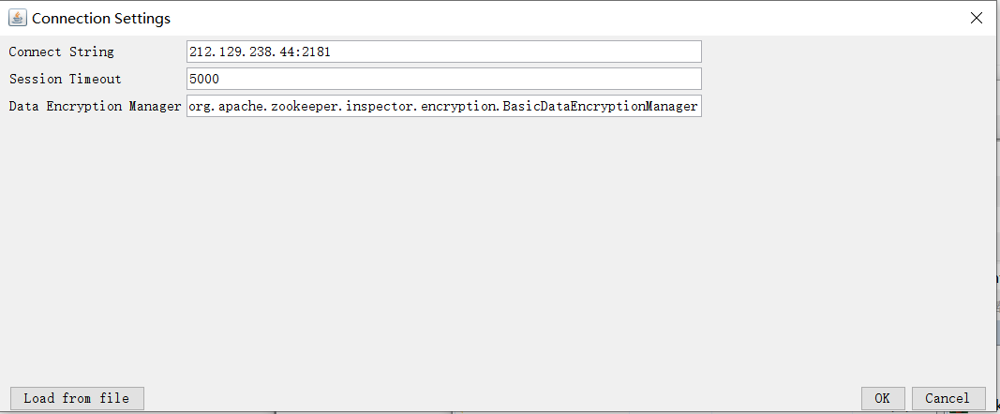

# zookee学习笔记

## 官网

https://zookeeper.apache.org/

## zookeeper安装教程

https://www.linuxidc.com/Linux/2018-03/151327.htm

启动zkserver：

./zkServer.sh start

./zkServer.sh status

测试部署地址：

http://212.129.238.44:2181

### 连接工具

ZooInspector

##  

## 简单使用命令

- 连接  
- bin/zkCli.sh

