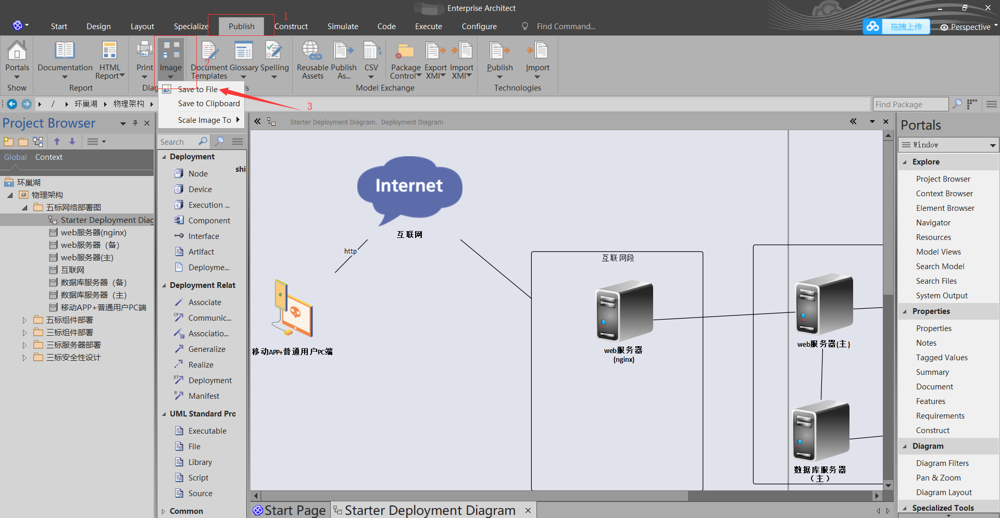
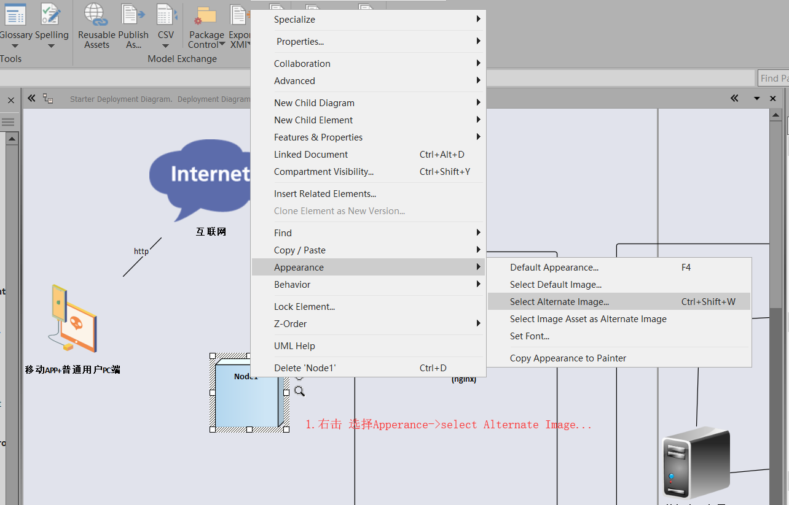

# EnterpriseArchitect使用指南.md

## 安装步骤

链接：https://pan.baidu.com/s/1GWelBuvFfPgempBOSVazbA 
提取码：love

## 使用指南

## 官网学习视频

https://sparxsystems.cn/resources/demos/index.html

### 导出图片步骤

## 部署图绘制

**【element】->appearance->alternate images** 

## 参考案例

